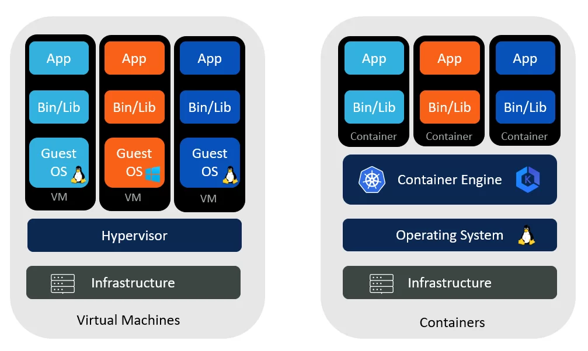

# Docker Fundamentals

## What is Docker?
- Docker is a platform designed to make it easier to create, deploy, and run applications by using containers. 
- Containers allow a developer to package up an application with all parts it needs, such as libraries and other dependencies, and ship it all out as one package.
- Docker streamlines the development workflow, reduces the “it works on my machine” problem.
- This ensures that the application will run on any other machine regardless of any customized settings that machine might have that could differ from the machine used for writing and testing the code.

## Containers V/S Virtual Machines

| Virtualization  | Containerization |
| ------------- | ------------- |
|Virtualizes hardware resources  | Virtualizes only OS resources |
| Requires the complete OS installation for every VM  | 	Installs the container only on a host OS  |
| A kernel is installed for every virtualized OS | Uses only the kernel of the underlying host OS |
| Heavyweight | Lightweight |
| Limited Performance | Native Performance |
| Fully Isolated | Process-level isolation |

## Key Benefits of Docker:

- Portability: Applications run the same, regardless of where they are deployed.
- Scalability: Easily scale applications up or down based on demand.
- Isolation: Containers encapsulate an application and its dependencies, ensuring that they run independently of each other.
  
## A Simple Docker WorkFlow

## Docker Architecture

