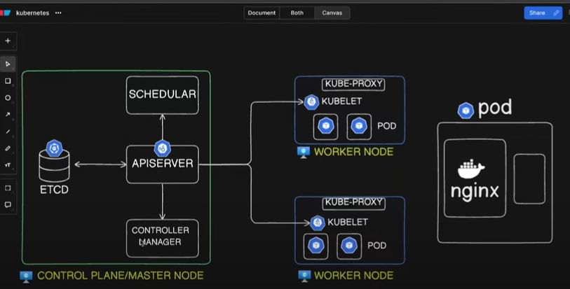

# Kubernetes Architecture

- Main components:

    1. Pod
    2. Node
    3. Api Server
    4. etcd
    5. Scheduler
    6. Controller Manager
    
- With Kubernetes we can host our application on the container. 

- Control Pane/Master node is Virtual Machine that host many administrative components. These Components helps you to run your work smoothly. Basically consider it as Board of Director in the company.

- In Worker Node actual work is happening.
  
- Control Plane or Master node give instructions to Kubernetes.

- Pod - nginx container encapsulated in the pod. One container per pod minimum. It is smallest object in Kubernetes.

- These 3 are components of **Master Node**. In High availability there are more nodes available in Master Node.
1. Api Server
2. Scheduler
3. Controller Manager

- **API Server** is center of it. Any request from customer or out side world comes to API Server first, so it will be main entry point of Kubernetes cluster to handling external and internal requests.work

- **Scheduler** is schedule your workload. It receives the request from API Server and then API server forward the request to Scheduler to find the suitable pod. Based on many factors scheduler find the suitable pod. It assigns workloads to specific nodes based on resource availability and other constraints.

- **Controller Manager** is combination of node controller, namespace controller, deployment controller. Controller manager make sure every object is up and running well by continuous monitoring. Ensure the desired state of your applications

- **ETCD** is key-value datastore.
RDBS database in form of rows and columns. RDBMS has fixed Schema.
Key-value datastore has no Schema and it store your data in document form (Json type format).

- Only Api Server interact with ETCD and it has authority to apply those changes in ETCD  database.
If we want to retrieve data from ETCD that also done by only API Server.

- **Worker Node** has 2 Components:
 1. Kube-Proxy
2. Kubelet

- **Kubelet** receives instructions from Master Node. Basically the kubelet is an agent that runs on each worker node.  
API Server send instructions to Kubelet to make some changes to the container running inside the pod.
Also notify to API Server. The kubelet communicates with the control plane, receiving instructions and reporting back the status of the node and its workloads. 

- **Kube-Proxy** enables networking withing Nodes. It allowing communication between the Pod by creating IP-Adresses rules.
It handle TCP, UDP, SCTP traffic, forwarding requests to the appropriate Pods within the cluster.

## End-to-End of *kubectl* Command

kubectl: Sends a request to the API server.
API Server: Validates the request and updates the state in etcd.
Controller Manager: Detects changes and ensures the desired state.
Scheduler: Assigns pods to nodes.
Kubelet: Runs containers on the assigned node.
Kube Proxy: Updates network rules to manage communication.

- User uses kubectl client and made a request to API Server. API Server receives the request and first authenticate the request, then validate the request. Lets suppose this request is to create a pod. 
Kubectl create pod command sent to API Server.

- The request further sent to ETCD and create an entry into database. After creating a pod ETCD sent notification to API Server about confirming about created entry. Scheduler running all the time. It find a pod and make a request to API Server that node has founded. Still pod has not been created.
API Server interact with Kubelet and sent request. Receiving a request Kubelet create a node in pod and sent notification back to API Server about created node. The entry again added into ETCD. At the end User will get the information about created node. 

- Authenticate- validate- retrieve- update in - etcd- from Schedular- send to kubelet- response to apiserver- client
